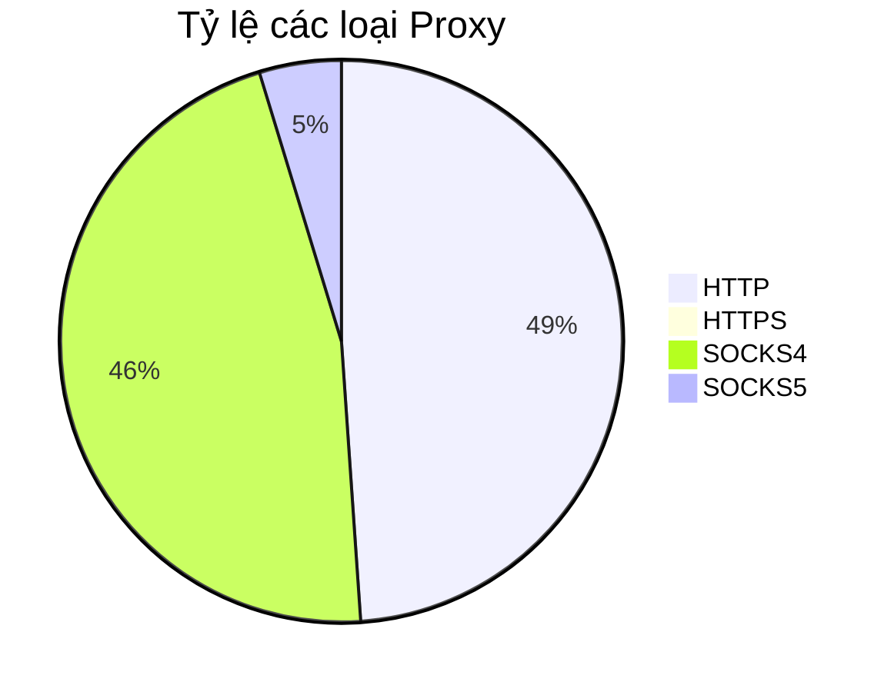

# 🌐 Danh Sách Proxy Miễn Phí (Tự Động Cập Nhật)

Dự án thu thập và kiểm tra proxy hàng ngày từ các nguồn uy tín, đảm bảo tính ổn định và tốc độ tối ưu. Hoạt động hoàn toàn tự động qua GitHub Actions.

---

### 📂 Danh Sách Proxy

| Loại Proxy | Đường dẫn file | Mô tả |
| :--- | :--- | :--- |
| **HTTP** | [http.txt](https://raw.githubusercontent.com/Ciara-Aa/Proxy/refs/heads/main/http.txt) | Proxy HTTP truyền thống |
| **HTTPS** | [https.txt](https://raw.githubusercontent.com/Ciara-Aa/Proxy/refs/heads/main/https.txt) | Proxy HTTPS bảo mật (SSL) |
| **SOCKS4** | [socks4.txt](https://raw.githubusercontent.com/Ciara-Aa/Proxy/refs/heads/main/socks4.txt) | Giao thức SOCKS phiên bản 4 |
| **SOCKS5** | [socks5.txt](https://raw.githubusercontent.com/Ciara-Aa/Proxy/refs/heads/main/socks5.txt) | Giao thức SOCKS phiên bản 5 cao cấp |

---

### 📊 Thống Kê Chi Tiết

- **Tổng số Proxy sống: `1,464`**
- **Proxy HTTP: `716`**
- **Proxy HTTPS: `0`**
- **Proxy SOCKS4: `679`**
- **Proxy SOCKS5: `69`**

**📅 Cập nhật lần cuối: `31/03/2026 00:16:59`** (Giờ Việt Nam - GMT+7)

---

> [!TIP]
> Danh sách này được cập nhật tự động mỗi giờ. Hãy bấm **Star** ⭐ để ủng hộ dự án nếu bạn thấy hữu ích!
