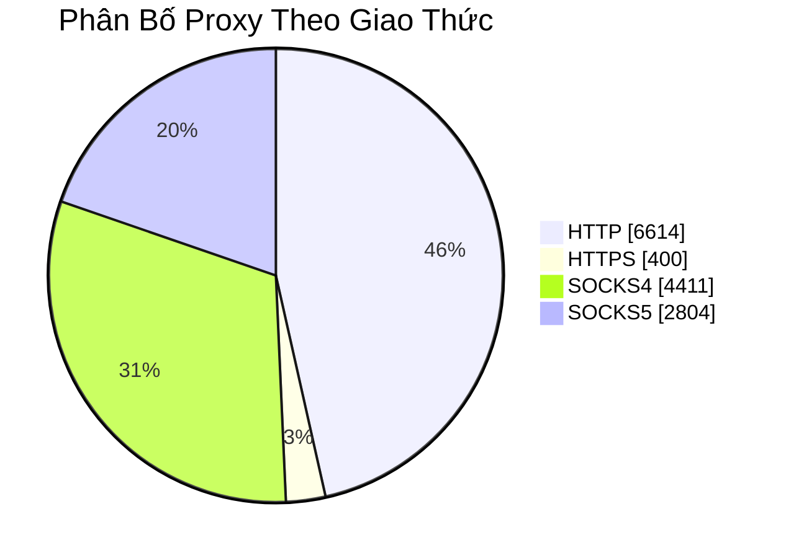

<div align="center">

# 🌐 PROXY FREE

### Danh Sách Proxy Miễn Phí — Tự Động Cập Nhật

[](https://github.com/Ciara-Aa/PROXY-free)
[](https://github.com/Ciara-Aa/PROXY-free/actions)
[](LICENSE)

</div>

---

## 📥 Tải Về Nhanh

| Giao Thức | Số Lượng | Tải Về |
| :---: | :---: | :---: |
| 🔵 **HTTP** | `6,614` | [📄 http.txt](https://raw.githubusercontent.com/Ciara-Aa/PROXY-free/refs/heads/main/http.txt) |
| 🟢 **HTTPS** | `400` | [📄 https.txt](https://raw.githubusercontent.com/Ciara-Aa/PROXY-free/refs/heads/main/https.txt) |
| 🟠 **SOCKS4** | `4,411` | [📄 socks4.txt](https://raw.githubusercontent.com/Ciara-Aa/PROXY-free/refs/heads/main/socks4.txt) |
| 🔴 **SOCKS5** | `2,804` | [📄 socks5.txt](https://raw.githubusercontent.com/Ciara-Aa/PROXY-free/refs/heads/main/socks5.txt) |

## 📊 Thống Kê



<div align="center">

| 📈 Chỉ Số | Giá Trị |
| :--- | :---: |
| **Tổng Proxy** | **14,229** |
| **Nguồn thu thập** | **6** |
| **Tần suất cập nhật** | **Mỗi 30 phút** |
| **Định dạng** | `IP:PORT # TYPE [CC]` |

</div>


## ⚡ Sử Dụng Nhanh

```bash
# Tải danh sách HTTP proxy
curl -sL https://raw.githubusercontent.com/Ciara-Aa/PROXY-free/refs/heads/main/http.txt -o http.txt

# Tải tất cả proxy
for type in http https socks4 socks5; do
  curl -sL "https://raw.githubusercontent.com/Ciara-Aa/PROXY-free/refs/heads/main/${type}.txt" -o "${type}.txt"
done
```

```python
# Python
import requests
proxies = requests.get("https://raw.githubusercontent.com/Ciara-Aa/PROXY-free/refs/heads/main/http.txt").text.splitlines()
print(f"Đã tải {len(proxies)} proxy")
```

---

<div align="center">

**📅 Cập nhật lần cuối: `31/03/2026 09:02:30`** (GMT+7)

⭐ Nếu dự án hữu ích, hãy bấm **Star** để ủng hộ!

</div>

> [!WARNING]
> **Miễn trách nhiệm:** Đây là proxy công cộng miễn phí, được thu thập từ các nguồn mở. Tốc độ và độ ổn định không được đảm bảo. Chỉ nên sử dụng cho mục đích nghiên cứu, học tập hoặc thử nghiệm. Người dùng tự chịu trách nhiệm về cách sử dụng.
